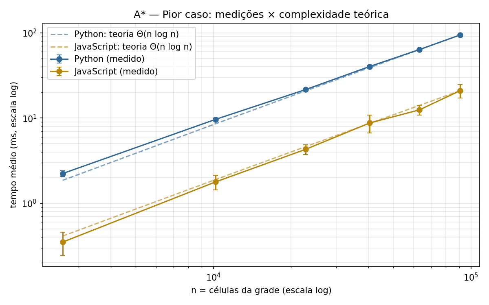
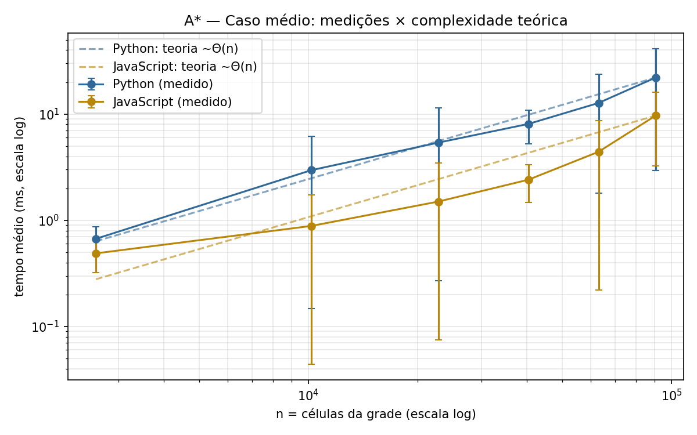
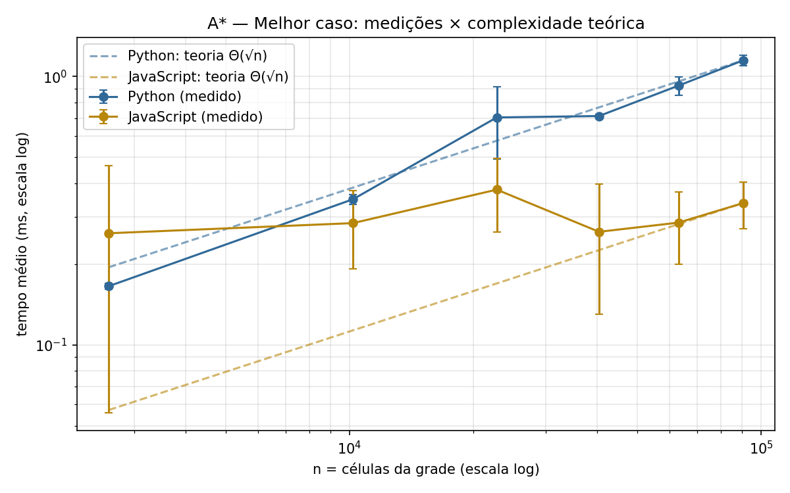
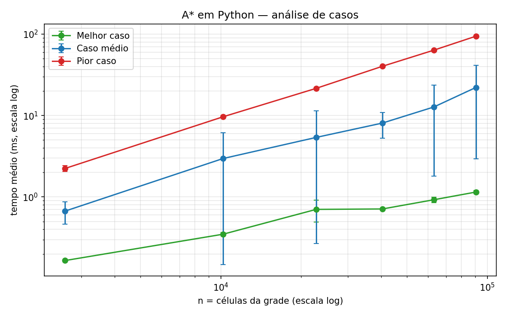
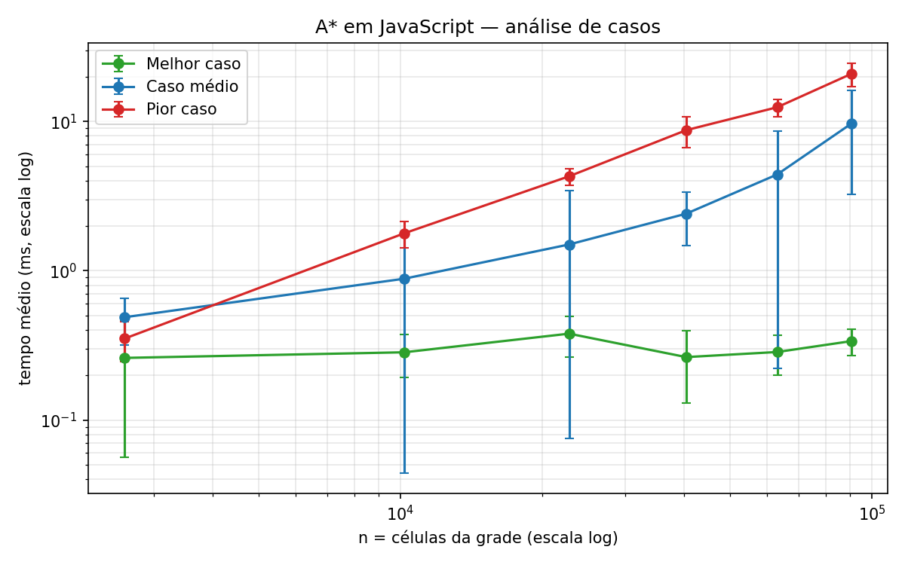
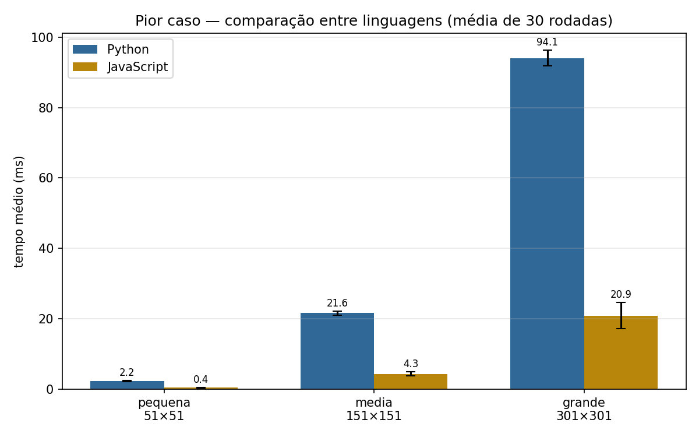
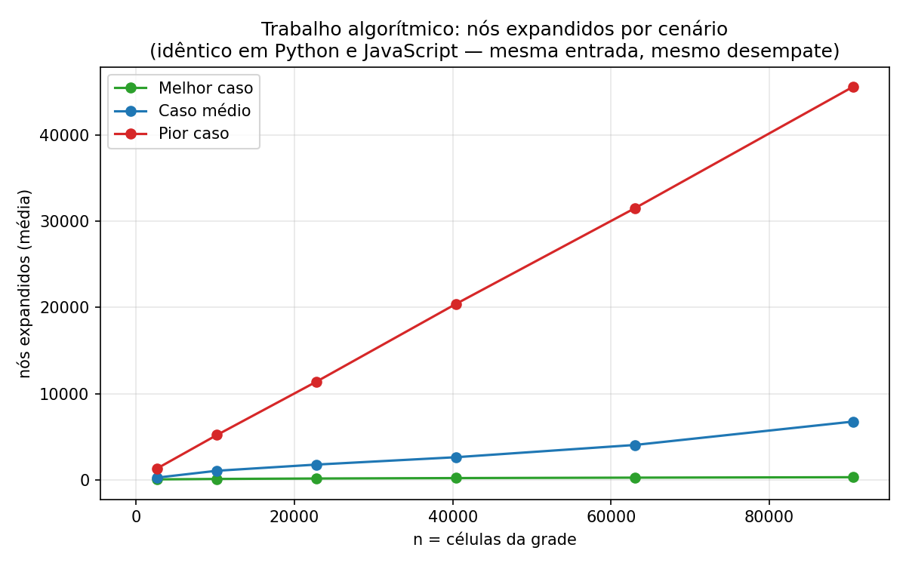

# Algoritmo A* (A-estrela) — Análise de Complexidade e Tempo de Execução

**Disciplina:** Teoria da Computação — **Professor:** Daniel Bezerra
**Equipe:** _(preencher nomes dos integrantes)_
**Linguagens:** Python 3.13 e JavaScript (Node.js 22)
**Repositório:** https://github.com/P4d1lh4/Projeto-Teoria-A-

> Este arquivo é a base do PDF do relatório. As tabelas de resultados são
> geradas automaticamente em [tabelas_resultados.md](tabelas_resultados.md)
> e os gráficos em `results/graficos/`.

---

## 1. Descrição do algoritmo

### 1.1 Problema resolvido

O A* resolve o problema do **caminho de menor custo entre dois vértices de um
grafo** com pesos não-negativos, quando se dispõe de uma **heurística** que
estima o custo restante até o destino. É o algoritmo padrão de *pathfinding*
em jogos, robótica e navegação.

Neste projeto o grafo é uma **grade 2D com obstáculos**: cada célula livre é
um vértice, vizinho das células livres adjacentes em 4 direções (custo 1 por
passo). A heurística usada é a **distância de Manhattan**
h(v) = |v.linha − destino.linha| + |v.coluna − destino.coluna|.

### 1.2 Lógica geral

O A* é uma busca de melhor-primeiro que generaliza o algoritmo de Dijkstra.
Cada vértice v na fronteira é ordenado pela função

```
f(v) = g(v) + h(v)
```

onde **g(v)** é o custo real acumulado da origem até v e **h(v)** é a
estimativa heurística de v até o destino. O Dijkstra é o caso particular
h ≡ 0: explora "em círculos" ao redor da origem. A heurística do A* "puxa" a
busca na direção do destino, reduzindo — às vezes drasticamente — o número de
vértices processados.

Duas propriedades da heurística garantem a **otimalidade** do resultado:

- **Admissível:** h(v) nunca superestima o custo real até o destino.
- **Consistente (monótona):** h(u) ≤ custo(u,v) + h(v) para toda aresta (u,v).
  Com consistência, cada vértice precisa ser expandido no máximo uma vez.

A distância de Manhattan satisfaz as duas propriedades em grades com movimento
em 4 direções e custo unitário (cada passo reduz a distância de Manhattan em
no máximo 1).

### 1.3 Pseudocódigo

```
A*(grade, origem, destino):
    aberta  <- heap-mínimo ordenado por (f, h, ordem de inserção)
    g[origem] <- 0
    insere origem na aberta com f = h(origem)
    enquanto aberta não vazia:
        v <- remove-mínimo(aberta)
        se v já foi expandido: continua          # entrada obsoleta no heap
        marca v como expandido
        se v = destino: retorna caminho reconstruído pelos pais
        para cada vizinho u de v (4 direções, livre, dentro da grade):
            g' <- g[v] + 1
            se g' < g[u]:                        # caminho melhor até u
                g[u] <- g'
                pai[u] <- v
                insere u na aberta com f = g' + h(u)
    retorna "sem caminho"
```

Detalhes de implementação (idênticos nas duas linguagens):

- Heap binário de mínimo com desempate por **(f, h, ordem de inserção)** —
  o desempate por menor h acelera a chegada ao destino entre nós de mesmo f,
  e a ordem de inserção torna a execução 100% determinística;
- *Lazy deletion*: em vez de atualizar a prioridade de um nó no heap
  (operação `decrease-key`), insere-se uma nova entrada e descartam-se as
  obsoletas ao removê-las;
- A versão Python usa `heapq` + dicionários; a JavaScript usa um heap binário
  próprio + `Map`/`Set` — mesmas estruturas assintóticas.

## 2. Classificação assintótica

Seja a grade com **n células** (V = n vértices; em grades, cada vértice tem
grau ≤ 4, logo E = O(n)). Com heap binário, cada inserção/remoção custa
O(log n) e cada aresta gera no máximo uma inserção.

| Limite | Valor | Quando ocorre |
|---|---|---|
| **Big-O (pior caso)** | **O(n log n)** | A heurística não orienta a busca: praticamente todos os vértices passam pelo heap (ex.: labirinto em serpentina, ou destino inalcançável). |
| **Big-Ω (melhor caso)** | **Ω(L)**, L = comprimento do caminho ótimo | A heurística é exata ao longo do caminho: o A* expande somente os L+1 nós da rota (com o custo do heap, Θ(L log L)). Na grade, L = √n no nosso cenário. |
| **Big-Θ** | **Não existe Θ global** — os limites acima não coincidem. Por caso: pior caso Θ(n log n); melhor caso Θ(√n · log n) no nosso cenário; caso médio ≈ Θ(n) empírico (fração constante da grade explorada, ver §6). | |

Memória: **O(n)** no pior caso (g-scores, pais, conjunto de expandidos e heap).

Em grafos implícitos gerais (espaços de estados exponenciais, ex.: 15-puzzle),
a forma usual de expressar a complexidade do A* é **O(b^d)** — fator de
ramificação b, profundidade d —, exponencial; a heurística reduz o expoente
efetivo, mas não muda a classe no pior caso.

### 2.1 Análise de casos (cenários dos experimentos)

- **Melhor caso — grade vazia, origem e destino na mesma linha.** Todo nó
  fora da linha reta tem f estritamente maior que o f dos nós da rota; o A*
  expande exatamente L+1 = √n nós (confirmado: 301 nós expandidos na grade
  301×301).
- **Caso médio — obstáculos aleatórios (densidade 25%), 30 grades distintas
  por tamanho.** A heurística orienta a busca, mas os desvios em torno dos
  obstáculos forçam exploração extra: medimos ~8% das células expandidas,
  fração aproximadamente constante → crescimento ≈ linear em n.
- **Pior caso — labirinto em serpentina.** O caminho zigue-zagueia por todas
  as linhas; a heurística "aponta para baixo" enquanto a rota precisa ir e
  voltar. O A* expande **todas** as células livres (45 601 nós na grade
  301×301) e degenera para o comportamento do Dijkstra com overhead da
  heurística.

## 3. Aplicabilidade e limitações

**Onde o A* é eficiente:**

- **Jogos** (*pathfinding* de unidades em mapas em grade ou *navmesh*);
- **Robótica e veículos autônomos** (planejamento de rota em mapas de ocupação);
- **Navegação/GPS** (variantes com heurísticas geográficas e hierarquias);
- **Planejamento automático** (STRIPS) e **resolução de puzzles** (15-puzzle,
  cubo mágico — com heurísticas de padrões);
- Qualquer domínio com **boa heurística admissível barata de calcular**.

**Limitações:**

- **Memória O(V)**: em espaços de estados gigantes a fronteira explode —
  variantes IDA*, SMA* e *fringe search* trocam memória por tempo;
- **Qualidade da heurística**: com h fraca o A* degenera para Dijkstra
  (nosso pior caso demonstra isso na prática); com h inadmissível perde a
  garantia de otimalidade (variantes *weighted A** exploram esse trade-off);
- **Ambientes dinâmicos**: mapas que mudam exigem replanejamento (D* Lite);
- Em grafos pequenos ou consultas repetidas com múltiplas origens/destinos,
  pré-processamento (ex.: *contraction hierarchies*) supera o A* puro.

## 4. Metodologia experimental

### 4.1 Ambiente de execução

| Item | Valor |
|---|---|
| Processador | Intel Core i5-10500 @ 3,10 GHz (6 núcleos / 12 threads) |
| RAM | 16 GB |
| Sistema operacional | Windows 11 Pro (build 26200) |
| Python | 3.13.7 (CPython) |
| Node.js | 22.21.1 (V8) |

Durante as medições os programas em segundo plano foram minimizados; cada
benchmark foi executado isoladamente (Python e Node em sequência, nunca em
paralelo).

### 4.2 Precisão de tempo

- **Python:** `time.perf_counter_ns()` (contador monotônico de nanossegundos);
- **JavaScript:** `process.hrtime.bigint()` (nanossegundos);
- Cronometra-se **apenas a chamada do algoritmo** — a geração das grades fica
  fora da medição;
- **3 rodadas de aquecimento descartadas** antes das 30 medidas, em ambas as
  linguagens — essencial no Node, onde o JIT do V8 otimiza o código nas
  primeiras execuções, e útil no Python para aquecer caches.

### 4.3 Protocolo de testes

| Cenário | Entrada | Execuções |
|---|---|---|
| Melhor caso | Grade vazia, origem→destino na mesma linha | 30 rodadas × 6 tamanhos |
| Caso médio | Obstáculos aleatórios 25%, **uma grade nova por rodada** (sementes 1..30) | 30 rodadas × 6 tamanhos |
| Pior caso | Labirinto em serpentina | 30 rodadas × 6 tamanhos |

Tamanhos de entrada (lado da grade; n = lado²): **pequena = 51×51**,
**média = 151×151**, **grande = 301×301**, mais os intermediários 101, 201 e
251 para dar resolução às curvas. Estatísticas: média e desvio-padrão das 30
rodadas (relatório completo em `results/resumo.csv`).

### 4.4 Equivalência entre as linguagens (comparação justa)

Para que a comparação meça **a linguagem/runtime, e não diferenças de
implementação**, as duas versões:

1. usam o mesmo PRNG (*mulberry32*) reproduzido bit a bit — verificado por
   valores de referência fixados nos testes das duas suítes;
2. geram **grades idênticas** (hash FNV-1a conferido);
3. usam o mesmo desempate no heap → **expandem exatamente os mesmos nós, na
   mesma ordem**.

O script `tools/verificar_equivalencia.py` automatiza essa verificação, e os
CSVs confirmam: nós expandidos e custos **idênticos** nas duas linguagens em
todos os 540 pares de medições.

## 5. Resultados

Tabelas completas: [tabelas_resultados.md](tabelas_resultados.md). Resumo dos
tamanhos nomeados (média ± desvio-padrão de 30 rodadas):

| Cenário | Grade | Nós expandidos | Python (ms) | JavaScript (ms) | Python/JS |
|---|---|---|---|---|---|
| Melhor | 301×301 | 301 | 1,149 ± 0,051 | 0,338 ± 0,067 | 3,4× |
| Médio | 301×301 | 6 756 | 22,101 ± 19,169 | 9,693 ± 6,448 | 2,3× |
| Pior | 301×301 | 45 601 | 94,109 ± 2,263 | 20,874 ± 3,672 | 4,5× |

### 5.1 Gráficos

Os três gráficos de **aderência** têm eixo X = n (células da grade), eixo
Y = tempo (ms), escala log-log e a **curva teórica normalizada sobreposta**
(linha tracejada) — atendendo ao padrão exigido pela especificação. Os demais
complementam a análise: casos por linguagem (log-log), comparação entre
linguagens (barras) e nós expandidos (trabalho algorítmico, eixo Y próprio):

- 
- 
- 
- 
- 
- 
- 

## 6. Discussão

**Aderência à teoria.** No pior caso, as medições das duas linguagens caem
sobre a reta c·n·log n em escala log-log — aderência quase perfeita ao longo
de uma ordem e meia de magnitude de n. No caso médio, o crescimento ≈ linear
(fração ~8% das células expandidas, levemente decrescente com n) também segue
a curva teórica, com barras de erro grandes — porque cada rodada usa uma grade
sorteada diferente: a variância é **do problema**, não do relógio. No melhor
caso, o Python adere bem a c·√n; o JavaScript fica praticamente plano (~0,3 ms
para qualquer n), evidência de que, em execuções submilissegundo, os custos
fixos do runtime dominam o termo assintótico (ver abaixo).

**Comparação entre linguagens.** O JavaScript foi 4,5–6,4× mais rápido no
pior caso e 1,4–3,6× no caso médio — efeito direto do JIT do V8, que compila o laço
quente para código de máquina, contra o interpretador de bytecode do CPython.
Como as duas implementações expandem exatamente os mesmos nós, a razão mede
o overhead por operação de cada runtime. Curiosamente, na menor entrada do
melhor caso o Python foi mais rápido (0,166 ms × 0,261 ms): o trabalho útil é
tão pequeno (51 nós) que o custo fixo de despacho/alocação do V8 pesa mais que
a diferença de velocidade por operação — um lembrete de que análise assintótica
descreve o crescimento, não o valor absoluto em entradas pequenas.

**Desvio-padrão.** Nos cenários determinísticos (melhor/pior) o desvio ficou
em poucos por cento da média, indicando medições estáveis; no caso médio o
desvio reflete a dispersão real entre as 30 grades sorteadas.

## 7. Reflexão final — P, NP e problemas relacionados

**O problema pertence a P.** Caminho mínimo com pesos não-negativos é
resolvido em tempo polinomial (Dijkstra/A*: O((V+E) log V)); a versão de
decisão — "existe caminho de custo ≤ k?" — está em P. O A* é, portanto, um
algoritmo polinomial para um problema de P (sobre grafos explícitos).

**Existe uma "versão NP"?** O problema em si não é NP-difícil, mas variantes
naturais são:

- **Caminho simples mais longo** — NP-completo (contém Hamiltoniano);
- **Caminho hamiltoniano / TSP** — NP-completo / NP-difícil;
- **Caminho mínimo com restrições de recursos** (ex.: custo ≤ k e consumo ≤ r)
  — NP-completo;
- **Multi-agent pathfinding ótimo** (várias unidades sem colisão, makespan
  mínimo) — NP-difícil;
- **(n²−1)-puzzle ótimo** (generalização do 15-puzzle) — NP-difícil: o A*
  continua **correto** nesses espaços de estados, mas roda em tempo
  exponencial O(b^d) — ser ótimo não significa ser polinomial.

**Conexão com a teoria.** O A* ilustra bem a fronteira: o mesmo algoritmo é
polinomial sobre grafos explícitos (problema em P) e exponencial sobre espaços
de estados implícitos de problemas NP-difíceis. A heurística desloca
constantes e expoentes efetivos — nunca a classe de complexidade.

## 8. Reprodutibilidade

```bash
# testes
python -m unittest discover -s python -v
node --test javascript/test/astar.test.js

# equivalência entre linguagens
python tools/verificar_equivalencia.py

# experimentos (gera results/*.csv)
python python/benchmark.py
node javascript/benchmark.js

# gráficos e tabelas (gera results/graficos/ e docs/tabelas_resultados.md)
python python/charts.py
```

## 9. Referências

- HART, P. E.; NILSSON, N. J.; RAPHAEL, B. *A Formal Basis for the Heuristic
  Determination of Minimum Cost Paths*. IEEE Transactions on Systems Science
  and Cybernetics, 1968.
- RUSSELL, S.; NORVIG, P. *Artificial Intelligence: A Modern Approach*. 4. ed.
  Pearson, 2020. (Capítulo 3 — busca informada)
- CORMEN, T. H. et al. *Introduction to Algorithms*. 4. ed. MIT Press, 2022.
  (Dijkstra e filas de prioridade)
- RATNER, D.; WARMUTH, M. *The (n²−1)-puzzle and related relocation problems*.
  Journal of Symbolic Computation, 1990. (NP-dificuldade do puzzle)
- GAREY, M. R.; JOHNSON, D. S. *Computers and Intractability*. Freeman, 1979.
